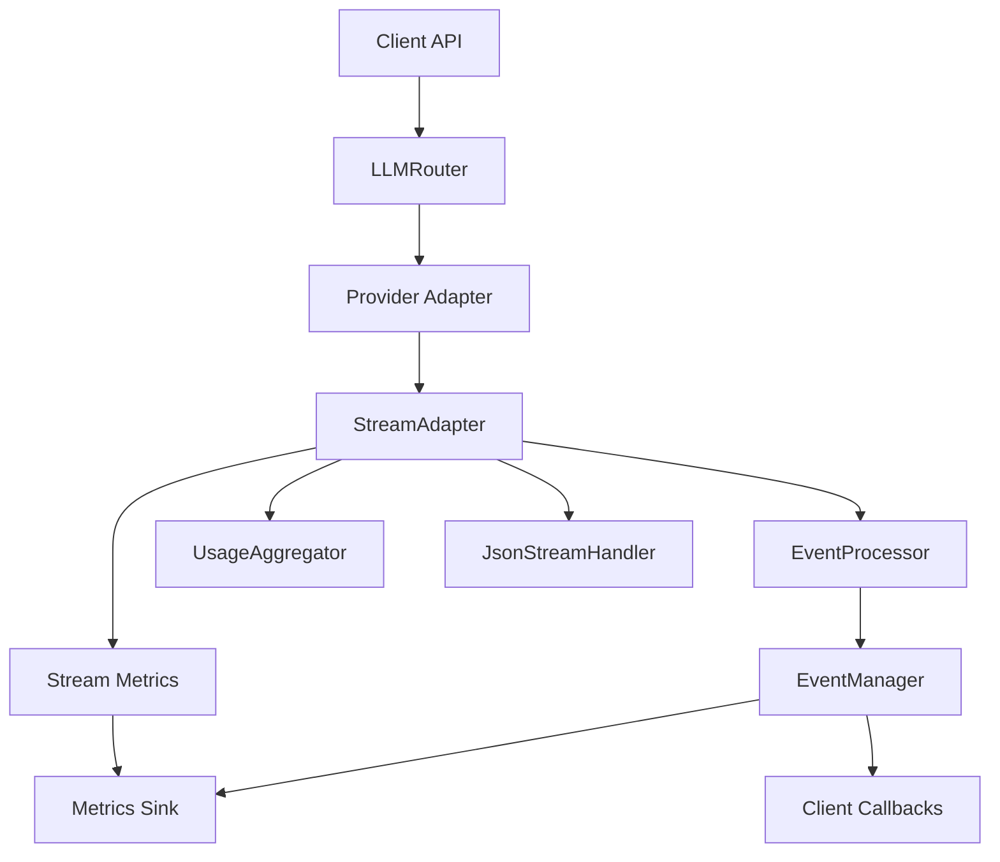

# Phase 4: Streaming & Events - Technical Design

## Executive Summary

Phase 4 enhances the streaming infrastructure to provide:
1. Consistent streaming behavior across all providers
2. Robust JSON response format handling
3. Reliable usage data finalization
4. Enhanced event system with filtering and transformation
5. Streaming-specific metrics and observability

## Architecture Overview



## Current State Analysis

### Working Components

1. **StreamAdapter** - Provider-specific delta normalization
2. **StreamDelta** - Normalized event structure
3. **StreamingHelper** - Collection and event helpers
4. **EventManager** - Basic event emission
5. **Provider Integration** - All providers use StreamAdapter

### Identified Issues

1. **JSON Streaming** (JSON post-processing heuristic in `SteerLLMClient.stream_with_usage`)
   - Crude deduplication using rfind("{") and rfind("}")
   - Doesn't handle nested JSON or arrays of objects
   - No validation during streaming

2. **Usage Finalization**
   - xAI doesn't provide streaming usage
   - Timing varies across providers
   - No fallback token counting

3. **Event System**
   - No event filtering/transformation
   - Missing provider metadata
   - Not integrated with client API

## Detailed Technical Design

### 4.1 Enhanced JSON Streaming

#### 4.1.1 JsonStreamHandler Class

```python
# steer_llm_sdk/streaming/json_handler.py

from typing import List, Dict, Any, Optional
import json
from enum import Enum

class JsonTokenType(Enum):
    OBJECT_START = "{"
    OBJECT_END = "}"
    ARRAY_START = "["
    ARRAY_END = "]"
    STRING = "string"
    NUMBER = "number"
    BOOLEAN = "boolean"
    NULL = "null"

class JsonStreamHandler:
    """Handles JSON streaming with proper parsing and deduplication."""
    
    def __init__(self):
        self.buffer = ""
        self.objects: List[Dict[str, Any]] = []
        self.depth = 0
        self.in_string = False
        self.escape_next = False
        
    def process_chunk(self, chunk: str) -> Optional[Dict[str, Any]]:
        """Process a streaming chunk and return complete JSON if found."""
        self.buffer += chunk
        
        # Try to extract complete JSON objects
        extracted = self._extract_json_objects()
        if extracted:
            # Return the most recent complete object
            return extracted[-1]
        return None
    
    def _extract_json_objects(self) -> List[Dict[str, Any]]:
        """Extract all complete JSON objects from buffer."""
        objects = []
        start_idx = 0
        
        for i, char in enumerate(self.buffer):
            if self.escape_next:
                self.escape_next = False
                continue
                
            if char == '\\' and not self.escape_next:
                self.escape_next = True
                continue
                
            if char == '"' and not self.escape_next:
                self.in_string = not self.in_string
                continue
                
            if self.in_string:
                continue
                
            if char in ['{', '[']:
                if self.depth == 0:
                    start_idx = i
                self.depth += 1
            elif char in ['}', ']']:
                self.depth -= 1
                if self.depth == 0:
                    # Found complete object or array
                    json_str = self.buffer[start_idx:i+1]
                    try:
                        obj = json.loads(json_str)
                        objects.append(obj)
                        # Clear processed part
                        self.buffer = self.buffer[i+1:]
                        return objects
                    except json.JSONDecodeError:
                        # Keep buffering
                        pass
                        
        return objects
    
    def get_final_object(self) -> Optional[Dict[str, Any]]:
        """Get the final complete object or attempt to parse buffer."""
        if self.objects:
            return self.objects[-1]
            
        # Try to parse remaining buffer
        if self.buffer.strip():
            try:
                return json.loads(self.buffer)
            except json.JSONDecodeError:
                # Attempt repair strategies
                return self._repair_json(self.buffer)
        return None
    
    def _repair_json(self, json_str: str) -> Optional[Dict[str, Any]]:
        """Attempt to repair incomplete JSON."""
        # Basic repair strategies
        json_str = json_str.strip()
        
        # Add missing closing braces
        open_braces = json_str.count('{') - json_str.count('}')
        if open_braces > 0:
            json_str += '}' * open_braces
            
        try:
            return json.loads(json_str)
        except json.JSONDecodeError:
            return None
```

#### 4.1.2 Integration with StreamAdapter

```python
# Updates to steer_llm_sdk/streaming/adapter.py

class StreamAdapter:
    def __init__(self, provider: str):
        # ... existing init ...
        self.json_handler: Optional[JsonStreamHandler] = None
        self.response_format: Optional[Dict[str, Any]] = None
        
    def set_response_format(self, response_format: Optional[Dict[str, Any]]):
        """Set response format to enable JSON handling."""
        self.response_format = response_format
        if response_format and response_format.get("type") == "json_object":
            self.json_handler = JsonStreamHandler()
            
    def normalize_delta(self, provider_delta: Any) -> StreamDelta:
        """Normalize with JSON awareness."""
        delta = self._normalize_provider_delta(provider_delta)
        
        # If JSON mode, process through handler
        if self.json_handler and delta.kind == "text":
            json_obj = self.json_handler.process_chunk(delta.value)
            if json_obj:
                return StreamDelta(
                    kind="json",
                    value=json_obj,
                    provider=delta.provider,
                    raw_event=delta.raw_event,
                    metadata={"complete_json": True}
                )
                
        return delta
```

### 4.2 Usage Aggregator System

#### 4.2.1 Base UsageAggregator

```python
# steer_llm_sdk/streaming/aggregator.py

from abc import ABC, abstractmethod
from typing import Dict, Any, Optional
import tiktoken

class UsageAggregator(ABC):
    """Base class for aggregating usage data during streaming."""
    
    def __init__(self, model: str):
        self.model = model
        self.prompt_tokens = 0
        self.completion_tokens = 0
        self.total_chunks = 0
        self.total_chars = 0
        
    @abstractmethod
    def estimate_prompt_tokens(self, messages: Any) -> int:
        """Estimate tokens in prompt."""
        pass
        
    @abstractmethod
    def count_chunk_tokens(self, text: str) -> int:
        """Count tokens in a text chunk."""
        pass
        
    def add_chunk(self, text: str):
        """Add a chunk to aggregation."""
        self.total_chunks += 1
        self.total_chars += len(text)
        self.completion_tokens += self.count_chunk_tokens(text)
        
    def get_usage(self) -> Dict[str, Any]:
        """Get aggregated usage data."""
        return {
            "prompt_tokens": self.prompt_tokens,
            "completion_tokens": self.completion_tokens,
            "total_tokens": self.prompt_tokens + self.completion_tokens,
            "estimated": True,
            "chunks": self.total_chunks,
            "characters": self.total_chars
        }

class TiktokenAggregator(UsageAggregator):
    """Token counting using tiktoken for OpenAI models."""
    
    def __init__(self, model: str):
        super().__init__(model)
        self.encoding = self._get_encoding(model)
        
    def _get_encoding(self, model: str):
        """Get appropriate tiktoken encoding."""
        try:
            if "gpt-4" in model:
                return tiktoken.encoding_for_model("gpt-4")
            elif "gpt-3.5" in model:
                return tiktoken.encoding_for_model("gpt-3.5-turbo")
            else:
                return tiktoken.get_encoding("cl100k_base")
        except Exception:
            return tiktoken.get_encoding("cl100k_base")
            
    def estimate_prompt_tokens(self, messages: Any) -> int:
        """Estimate tokens using tiktoken."""
        if isinstance(messages, str):
            self.prompt_tokens = len(self.encoding.encode(messages))
        elif isinstance(messages, list):
            total = 0
            for msg in messages:
                if hasattr(msg, 'content'):
                    total += len(self.encoding.encode(msg.content))
            self.prompt_tokens = total
        return self.prompt_tokens
        
    def count_chunk_tokens(self, text: str) -> int:
        """Count tokens in chunk."""
        return len(self.encoding.encode(text))

class CharacterAggregator(UsageAggregator):
    """Fallback character-based token estimation."""
    
    CHARS_PER_TOKEN = 4  # Rough estimate
    
    def estimate_prompt_tokens(self, messages: Any) -> int:
        """Estimate tokens from characters."""
        char_count = 0
        if isinstance(messages, str):
            char_count = len(messages)
        elif isinstance(messages, list):
            for msg in messages:
                if hasattr(msg, 'content'):
                    char_count += len(msg.content)
        self.prompt_tokens = char_count // self.CHARS_PER_TOKEN
        return self.prompt_tokens
        
    def count_chunk_tokens(self, text: str) -> int:
        """Estimate tokens from characters."""
        return len(text) // self.CHARS_PER_TOKEN
```

### 4.3 Event Processor Pipeline

#### 4.3.1 EventProcessor Design

```python
# steer_llm_sdk/streaming/processor.py

from typing import List, Callable, Any, Optional
from dataclasses import dataclass
import asyncio

@dataclass
class EventFilter:
    """Filter for event processing."""
    event_type: Optional[str] = None
    provider: Optional[str] = None
    predicate: Optional[Callable[[Any], bool]] = None
    
    def matches(self, event: Any) -> bool:
        """Check if event matches filter."""
        if self.event_type and getattr(event, 'type', None) != self.event_type:
            return False
        if self.provider and getattr(event, 'provider', None) != self.provider:
            return False
        if self.predicate and not self.predicate(event):
            return False
        return True

@dataclass
class EventTransformer:
    """Transform events in pipeline."""
    name: str
    transform: Callable[[Any], Any]
    filter: Optional[EventFilter] = None
    
class EventProcessor:
    """Process streaming events through a pipeline."""
    
    def __init__(self):
        self.filters: List[EventFilter] = []
        self.transformers: List[EventTransformer] = []
        self.metrics = {
            "events_processed": 0,
            "events_filtered": 0,
            "events_transformed": 0,
            "processing_errors": 0
        }
        
    def add_filter(self, filter: EventFilter):
        """Add a filter to the pipeline."""
        self.filters.append(filter)
        
    def add_transformer(self, transformer: EventTransformer):
        """Add a transformer to the pipeline."""
        self.transformers.append(transformer)
        
    async def process_event(self, event: Any) -> Optional[Any]:
        """Process event through pipeline."""
        self.metrics["events_processed"] += 1
        
        # Apply filters
        for filter in self.filters:
            if not filter.matches(event):
                self.metrics["events_filtered"] += 1
                return None
                
        # Apply transformations
        result = event
        for transformer in self.transformers:
            if transformer.filter and not transformer.filter.matches(result):
                continue
            try:
                result = transformer.transform(result)
                self.metrics["events_transformed"] += 1
            except Exception as e:
                self.metrics["processing_errors"] += 1
                # Log error but continue processing
                continue
                
        return result
    
    def create_batched_processor(self, batch_size: int = 10, batch_timeout: float = 0.1):
        """Create a batched event processor."""
        return BatchedEventProcessor(self, batch_size, batch_timeout)

class BatchedEventProcessor:
    """Process events in batches for efficiency."""
    
    def __init__(self, processor: EventProcessor, batch_size: int, timeout: float):
        self.processor = processor
        self.batch_size = batch_size
        self.timeout = timeout
        self.batch: List[Any] = []
        self.batch_task: Optional[asyncio.Task] = None
        
    async def add_event(self, event: Any):
        """Add event to batch."""
        self.batch.append(event)
        
        if len(self.batch) >= self.batch_size:
            await self._process_batch()
        elif not self.batch_task:
            self.batch_task = asyncio.create_task(self._timeout_handler())
            
    async def _timeout_handler(self):
        """Process batch after timeout."""
        await asyncio.sleep(self.timeout)
        await self._process_batch()
        
    async def _process_batch(self):
        """Process accumulated batch."""
        if not self.batch:
            return
            
        batch_to_process = self.batch
        self.batch = []
        
        # Process events in parallel
        tasks = [self.processor.process_event(event) for event in batch_to_process]
        await asyncio.gather(*tasks)
        
        if self.batch_task:
            self.batch_task.cancel()
            self.batch_task = None
```

### 4.4 Enhanced Event Integration

#### 4.4.1 Updated EventManager

```python
# Updates to steer_llm_sdk/streaming/manager.py

class EnhancedEventManager(EventManager):
    """Enhanced event manager with processor support."""
    
    def __init__(self, processor: Optional[EventProcessor] = None, **kwargs):
        super().__init__(**kwargs)
        self.processor = processor
        self.correlation_id = None
        
    def set_correlation_id(self, correlation_id: str):
        """Set correlation ID for all events."""
        self.correlation_id = correlation_id
        
    async def emit_start(self, meta: Any) -> None:
        """Emit start event with processing."""
        if self.correlation_id:
            meta["correlation_id"] = self.correlation_id
            
        if self.processor:
            meta = await self.processor.process_event(meta)
            if meta is None:
                return
                
        await super().emit_start(meta)
        
    # Similar updates for other emit methods...
```

### 4.5 Client API Integration

#### 4.5.1 StreamingOptions Configuration

```python
# steer_llm_sdk/models/streaming.py

from dataclasses import dataclass
from typing import Optional, Dict, Any

@dataclass
class StreamingOptions:
    """Configuration for streaming behavior."""
    enable_json_stream_handler: bool = False
    enable_usage_aggregation: bool = True
    enable_event_processor: bool = False
    event_callbacks: Optional[Dict[str, Any]] = None
    event_processor: Optional[Any] = None
    measure_ttft: bool = True
    batch_events: bool = True
    batch_size: int = 10
    batch_timeout: float = 0.1
```

#### 4.5.2 Updated stream_with_usage

```python
# Updates to steer_llm_sdk/api/client.py

async def stream_with_usage(self, messages, model, **kwargs):
    """Enhanced streaming with events and JSON support."""
    # Extract streaming options
    streaming_options = kwargs.pop('streaming_options', StreamingOptions())
    
    # Legacy support for direct params
    if 'enable_json_stream_handler' in kwargs:
        streaming_options.enable_json_stream_handler = kwargs.pop('enable_json_stream_handler')
    
    # Extract event callbacks if provided
    event_callbacks = streaming_options.event_callbacks or {}
    event_processor = streaming_options.event_processor
    
    # Create event manager
    events = EnhancedEventManager(
        processor=event_processor,
        on_start=event_callbacks.get('on_start'),
        on_delta=event_callbacks.get('on_delta'),
        on_usage=event_callbacks.get('on_usage'),
        on_complete=event_callbacks.get('on_complete'),
        on_error=event_callbacks.get('on_error')
    )
    
    # Set correlation ID
    import uuid
    events.set_correlation_id(str(uuid.uuid4()))
    
    # Create response wrapper
    response_wrapper = StreamingResponseWithUsage()
    
    try:
        # Stream with enhanced handling
        async for chunk, usage in self.router.generate_stream(
            messages, model, params, return_usage=True
        ):
            if chunk:
                response_wrapper.add_chunk(chunk)
                if events.on_delta:
                    await events.emit_delta({
                        'chunk': chunk,
                        'index': len(response_wrapper.chunks)
                    })
            if usage:
                response_wrapper.add_usage(usage)
                if events.on_usage:
                    await events.emit_usage(usage)
                    
        # Enhanced JSON handling
        if params.get('response_format', {}).get('type') == 'json_object':
            handler = JsonStreamHandler()
            for chunk in response_wrapper.chunks:
                handler.process_chunk(chunk)
            final_json = handler.get_final_object()
            if final_json:
                response_wrapper.chunks = [json.dumps(final_json)]
                
        if events.on_complete:
            await events.emit_complete({
                'text': response_wrapper.get_text(),
                'usage': response_wrapper.usage,
                'model': response_wrapper.model
            })
            
    except Exception as e:
        if events.on_error:
            await events.emit_error(e)
        raise
        
    return response_wrapper
```

## Implementation Timeline

### Week Overview

- **Day 1-2**: JSON Streaming Enhancement
- **Day 3-4**: Usage Aggregator Implementation  
- **Day 5**: Event Processor Pipeline
- **Day 6**: Integration and Testing
- **Day 7**: Documentation and Polish

### Detailed Schedule

#### Day 1: JSON Handler Core
- Morning: Implement JsonStreamHandler
- Afternoon: Unit tests for JSON parsing
- Evening: Edge case handling

#### Day 2: JSON Integration
- Morning: Integrate with StreamAdapter
- Afternoon: Update client API
- Evening: Test with all providers

#### Day 3: Usage Aggregator Base
- Morning: Design aggregator interface
- Afternoon: Implement base classes
- Evening: Provider-specific aggregators

#### Day 4: Usage Integration
- Morning: Integrate with streaming
- Afternoon: Fallback mechanisms
- Evening: Accuracy testing

#### Day 5: Event Processing
- Morning: EventProcessor implementation
- Afternoon: Filtering and transformation
- Evening: Batching support

#### Day 6: Full Integration
- Morning: Client API updates
- Afternoon: End-to-end testing
- Evening: Performance optimization

#### Day 7: Polish
- Morning: Documentation
- Afternoon: Examples and guides
- Evening: Final review

## Testing Strategy

### Unit Tests
- JsonStreamHandler parsing tests (nested objects, arrays)
- UsageAggregator token counting with/without tiktoken
- EventProcessor filtering/transformation
- Mock-based provider tests
- StreamingOptions configuration tests

### Integration Tests
- JSON streaming with all providers
- OpenAI Responses API incremental delta validation
- Anthropic multi-content block handling
- xAI usage aggregation accuracy
- Usage accuracy validation with confidence scores
- Event pipeline stress testing
- Client API compatibility

### Performance Tests
- Streaming throughput with typical chunk sizes
- Event processing overhead (target < 1ms)
- Memory usage profiling
- TTFT (Time To First Token) measurements
- JSON parsing impact with real payloads

## Success Metrics

1. **JSON Streaming**
   - ✅ Handles nested JSON and arrays correctly
   - ✅ No duplicate objects in OpenAI/Anthropic streams
   - ✅ Validates during streaming
   - ✅ < 5ms parsing overhead with typical payloads

2. **Usage Accuracy**
   - ✅ Within 5% of actual usage with confidence scores
   - ✅ All providers supported (including xAI fallback)
   - ✅ Tiktoken optional, CharacterAggregator fallback
   - ✅ < 10ms aggregation overhead

3. **Event Processing**
   - ✅ < 1ms per event overhead (non-blocking)
   - ✅ Supports 1000+ events/second with batching
   - ✅ Zero event loss
   - ✅ Configurable pipeline via StreamingOptions

4. **Integration**
   - ✅ All current tests remain green (233+)
   - ✅ Backward compatible
   - ✅ Opt-in features via StreamingOptions
   - ✅ TTFT metrics exposed
   - ✅ Well documented with examples

## Risk Mitigation

1. **Performance Impact**
   - Profile all hot paths
   - Lazy initialization
   - Optional features (via StreamingOptions)
   - Benchmark continuously
   - JSON parsing impact analysis with typical chunk sizes

2. **Provider Changes**
   - Isolated provider logic
   - Comprehensive mocking
   - Version pinning
   - Fallback strategies

3. **Backward Compatibility**
   - Keep existing APIs
   - Feature flags (enable_json_stream_handler)
   - Gradual migration
   - Extensive testing

4. **Configuration Sprawl**
   - Consolidate under StreamingOptions
   - Environment variable overrides
   - Sensible defaults
   - Clear documentation

## Conclusion

Phase 4 transforms the streaming infrastructure from basic text streaming to a sophisticated event-driven system with:
- Robust JSON handling
- Accurate usage tracking
- Flexible event processing
- Enhanced observability

This positions the SDK for advanced streaming scenarios while maintaining simplicity for basic use cases.